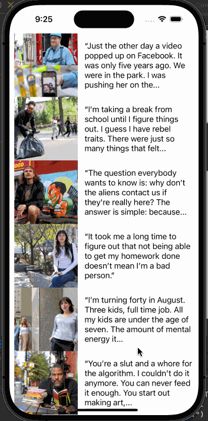

# Project 5 - *cc's tumblr*

Submitted by: **Cecilia Truong**

**cc's tumblr** is an app that uses the Tumblr API to fetch Tumblr posts from the humansofnewyork blog.

Time spent: **4** hours spent in total

## Required Features

The following **required** functionality is completed:

- [x] App has a configured table view and table view call
- [x] App populates the table view with data fetched from an API

The following **optional** features are implemented:

- [ ] App fetches posts from a different Tumblr blog
- [ ] App has a refresh control to update the table view

The following **additional** features are implemented:

- [ ] List anything else that you can get done to improve the app functionality!

## Video Walkthrough

## Notes

I had troubles with connecting the table cell items.

## License

    Copyright [yyyy] [name of copyright owner]

    Licensed under the Apache License, Version 2.0 (the "License");
    you may not use this file except in compliance with the License.
    You may obtain a copy of the License at

        http://www.apache.org/licenses/LICENSE-2.0

    Unless required by applicable law or agreed to in writing, software
    distributed under the License is distributed on an "AS IS" BASIS,
    WITHOUT WARRANTIES OR CONDITIONS OF ANY KIND, either express or implied.
    See the License for the specific language governing permissions and
    limitations under the License.
